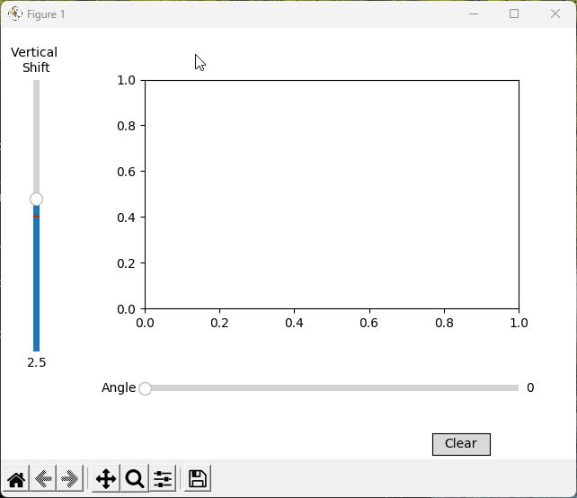

# Optimal Grid Placement in Triangles


## Table of Contents
- [Project Overview](#-project-overview)
- [Getting Started](#-gettind-started)
- [Main Methodology](#-main-methodology)
- [Computational Complexity](#-computational-complexity)
- [Future Implementations](#-future-implementations)
- [Author](#-author)
- [LICENCE](#-licence)


# Project Overview
- **Objective**: Optimize the placement of a grid within a triangle by rotating and shifting the grid to maximize or minimize the number of points inside the triangle.
- **Key Features**:
  - **Geometric Algorithms**: Utilizes advanced algorithms to rotate points and check point inclusion within a triangle.
  - **Interactive Visualization**: Employs `matplotlib` for dynamic visualizations, allowing users to interact with the grid and triangle using sliders.
  - **Optimization**: Implements techniques to find the optimal grid placement, enhancing computational efficiency.


<div align="center">
  
  
</div>

<p>
  <br>
</p>


### 🌍 Real-World Applications

This project has direct applications in optimizing land field layouts, which can significantly enhance agricultural planning, land surveying, and resource management. By increasing the efficiency of grid placements, we can better utilize space and improve overall productivity.

#### Agricultural Planning
Optimizing land field layouts can lead to more efficient use of agricultural land. This can result in:
- **Higher Crop Yields**: By maximizing the use of available space, farmers can plant more crops and increase their yields.
- **Reduced Waste**: Efficient layouts minimize unused or poorly utilized areas, reducing waste and improving overall land use.
- **Improved Irrigation**: Better planning can lead to more effective irrigation systems, ensuring that water is distributed evenly and efficiently across the fields.

<p>
  <br>
</p>

# Getting Started

These instructions will get you a copy of the project up and running on your local machine for development and testing purposes.
1. Clone the repository:
    ```bash
    git clone https://github.com/kinstras/optimized-grid-in-triangle.git
    cd optimal-grid-placement
    ```
2. Install the required dependencies:
    ```bash
    pip install -r requirements.txt
    ```
<p>
    Alternatively, you can install each package individually using the following commands:
</p>

<ul>
    <li><code>pip install numpy</code> - For numerical operations</li>
    <li><code>pip install matplotlib</code> - For plotting graphs and visualizations</li>
    <li><code>pip install time</code> - For compute execution time </li>
</ul>

<p>
    Make sure to install these packages in the same environment where you plan to run the code. If you encounter any issues, refer to the package documentation or seek help from the community.
</p>

<p>
  <br>
</p>

### 💻 Usage
Run the project with the following command:
```bash
python main.py
```

<p>
  <br>
</p>

### project_directory

├── python/

│ ├── main.py # Main script

│ ├── util.py # # Rotate a point around a given center by a specified angle && checks if a point is inside a given triangle

│ ├── plot.py # Updates GUI 

│ └── test.py # # Calculates and plot the improvement percentage for a given length L

<p>
  <br>
</p>

# Main Methodology
In this study, we examine the optimal placement of a grid frame within a random scalene triangle. The process involves the following steps:

1. **Triangle Design**:
   - User creates a random scalene triangle.
   - The triangle is defined by its vertices in a Cartesian coordinate system.

2. **Grid Frame Definition**:
   - We define a grid frame with a spacing of nxn meter for each node.
   - The grid is initially placed with a random angle and vertical shift.

3. **Optimal Placement Search**:
   - We rotate the grid by 90° with a step of 1°.
   - We shift the grid vertically with a step of 0.1 meter.
   - For each combination of angle and shift, we calculate the number of grid nodes that lie within the triangle.
   - We record the angle and shift that yield the maximum number of nodes within the triangle.


4. **Improvement Factor Calculation**:
   - We calculate the improvement factor as the percentage increase in the number of nodes compared to the initial placement.
   - Calculate the improvement factor using the formula:


  $$\text{Improvement Factor} = \left(\frac{\text{Max Points} - \text{Average Points of Random Position}}{\text{Average Points of Random Position}}\right) \times 100$$

     
# Author
- **Konstantinos Malakis** - Initial Work

# Licence
This project is licensed under the MIT License - see the [LICENCE.md](#-licence.md) file for details


