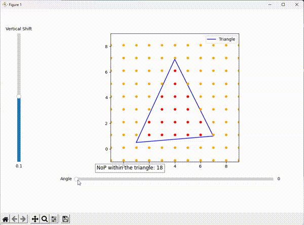
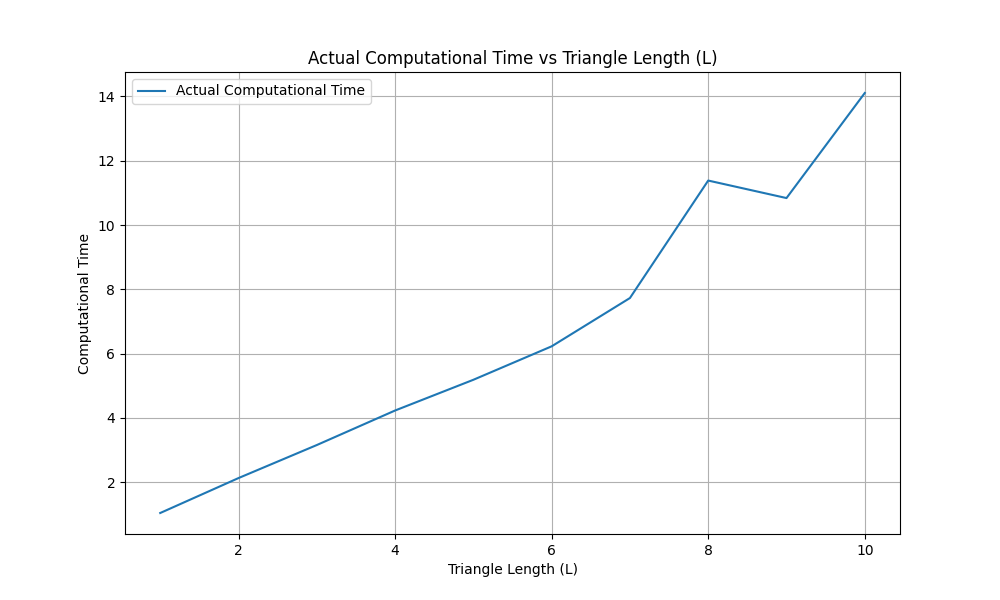
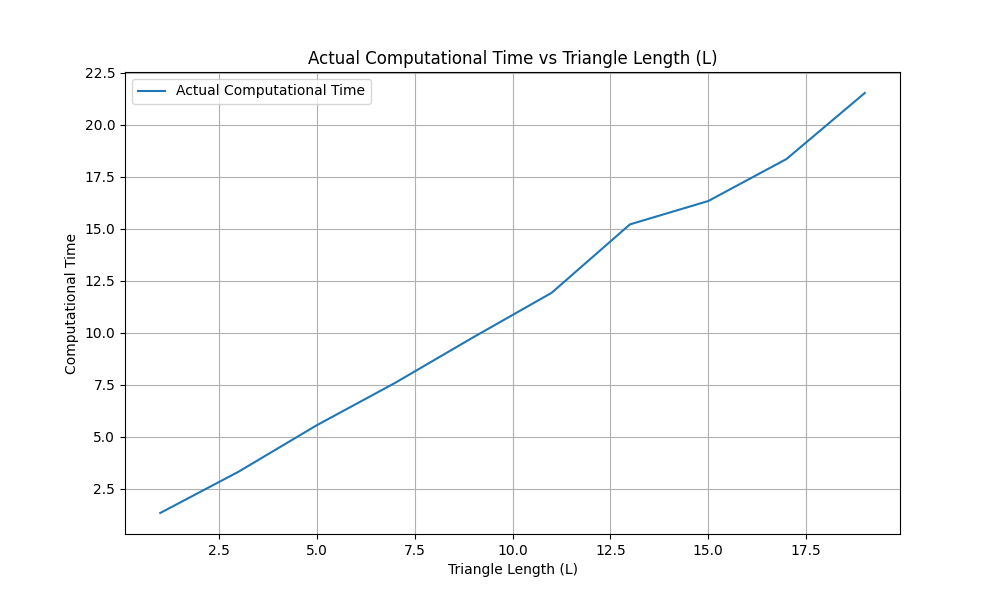
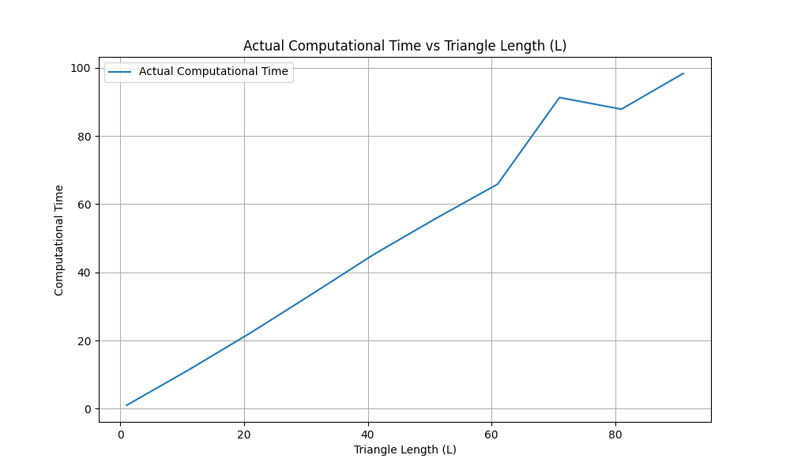
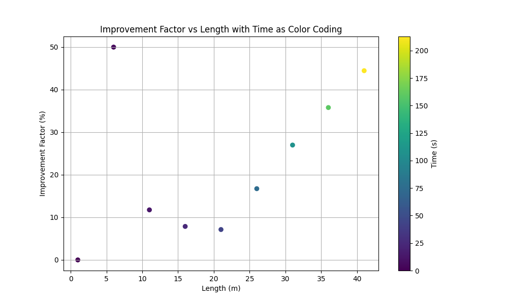
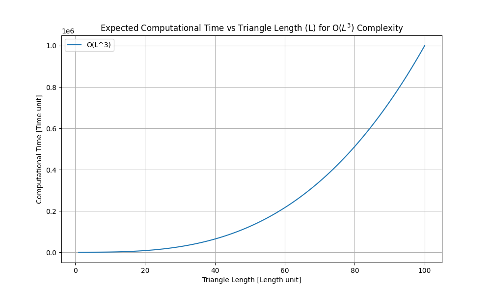

# Optimal Grid Placement in Triangles


## Table of Contents
- [Project Overview](#-project-overview)
- [Main Methodology](#-main-methodology)
- [Computational Complexity](#-computational-complexity)
- [Future Implementations](#-future-implementations)


# 🔍 Project Overview
- **Objective**: Optimize the placement of a grid within a triangle by rotating and shifting the grid to maximize or minimize the number of points inside the triangle.
- **Key Features**:
  - **Geometric Algorithms**: Utilizes advanced algorithms to rotate points and check point inclusion within a triangle.
  - **Interactive Visualization**: Employs `matplotlib` for dynamic visualizations, allowing users to interact with the grid and triangle using sliders.
  - **Optimization**: Implements techniques to find the optimal grid placement, enhancing computational efficiency.


<div align="center">
  
  
</div>

<p>
  <br>
</p>

### 🛠 Technologies Used
- **Python**: The core programming language for the project.
- **NumPy**: For numerical computations and grid manipulations.
- **Matplotlib**: For creating interactive plots and visualizations.

<p>
  <br>
</p>

### 🌍 Real-World Applications

This project has direct applications in optimizing land field layouts, which can significantly enhance agricultural planning, land surveying, and resource management. By increasing the efficiency of grid placements, we can better utilize space and improve overall productivity.

#### Agricultural Planning
Optimizing land field layouts can lead to more efficient use of agricultural land. This can result in:
- **Higher Crop Yields**: By maximizing the use of available space, farmers can plant more crops and increase their yields.
- **Reduced Waste**: Efficient layouts minimize unused or poorly utilized areas, reducing waste and improving overall land use.
- **Improved Irrigation**: Better planning can lead to more effective irrigation systems, ensuring that water is distributed evenly and efficiently across the fields.

#### Land Surveying
Enhanced grid placements can streamline the process of land surveying by:
- **Accurate Measurements**: Providing precise and consistent grid layouts helps surveyors take accurate measurements and map out land more effectively.
- **Time Efficiency**: Optimized layouts reduce the time required for surveying large areas, making the process quicker and more cost-effective.
- **Resource Allocation**: Efficient surveying allows for better allocation of resources, such as manpower and equipment, leading to more effective project management.

#### Resource Management
Optimizing land use through better grid placements can also improve resource management by:
- **Sustainable Practices**: Encouraging the use of sustainable practices that maximize land productivity while minimizing environmental impact.
- **Cost Savings**: Reducing the costs associated with land development and maintenance by utilizing space more effectively.
- **Enhanced Planning**: Providing a framework for better planning and decision-making in land development projects, ensuring that resources are used wisely and efficiently.

By implementing these optimizations, we can significantly enhance the efficiency and productivity of various land-related activities, leading to better outcomes in agricultural planning, land surveying, and resource management.


<p>
  <br>
</p>

### 📈 Highlights
- Achieved significant improvements in grid placement efficiency.
- Developed a user-friendly interface for interactive exploration of geometric configurations.
- Leveraged scientific computing techniques to solve complex geometric problems.

<p>
  <br>
</p>

### 🚀 Installation
1. Clone the repository:
    ```bash
    git clone https://github.com/kinstras/optimal-grid-placement.git
    cd optimal-grid-placement
    ```
2. Install the required dependencies:
    ```bash
    pip install -r requirements.txt
    ```
<p>
    Alternatively, you can install each package individually using the following commands:
</p>

<ul>
    <li><code>numpy</code> - For numerical operations</li>
    <li><code>matplotlib</code> - For plotting graphs and visualizations</li>
    <li><code>time</code> - For compute execution time </li>
</ul>

<p>
    Make sure to install these packages in the same environment where you plan to run the code. If you encounter any issues, refer to the package documentation or seek help from the community.
</p>

<p>
  <br>
</p>

### 💻 Usage
Run the project with the following command:
```bash
python main.py
```

<p>
  <br>
</p>

### project_directory

├── python/

│ ├── main.py # Main script

│ ├── util.py # # Rotate a point around a given center by a specified angle && checks if a point is inside a given triangle

│ ├── plot.py # Updates GUI 

│ └── test.py # # Calculates and plot the improvement percentage for a given length L

<p>
  <br>
</p>

# Main Methodology
In this study, we examine the optimal placement of a grid frame within a random scalene triangle. The process involves the following steps:

1. **Triangle Design**:
   - We create a random scalene triangle with side lengths L.
   - The triangle is defined by its vertices in a Cartesian coordinate system.

2. **Grid Frame Definition**:
   - We define a grid frame with a spacing of 1x1 meter for each node.
   - The grid is initially placed with a random angle and vertical shift.

3. **Optimal Placement Search**:
   - We rotate the grid by 360° with a step of 1°.
   - We shift the grid vertically with a step of 0.1 meter.
   - For each combination of angle and shift, we calculate the number of grid nodes that lie within the triangle.
   - We record the angle and shift that yield the maximum number of nodes within the triangle.


4. **Improvement Factor Calculation**:
   - We calculate the improvement factor as the percentage increase in the number of nodes compared to the initial placement.
   - Calculate the improvement factor for each value of L using the formula:


  $$\text{Improvement Factor} = \left(\frac{\text{Max Points} - \text{Min Points}}{\text{Min Points}}\right) \times 100$$

     
5. **Result Analysis**:
   - We plotted the relationship between the improvement factor and the increase in L of the triangle.

     
<div align="center">
  
  
  
</div>

<p>
  <br>
</p>


We collected data for lengths (\(L\)) ranging from 1 meter to 51 meters to analyze how the improvement factor relates to length over time. Our analysis involves three key variables:
- **Length (\(L\))**: The range of lengths from 1 meter to 51 meters.
- **Improvement Factor**: The measure of how much the optimization improves efficiency.
- **Time**: Represented using color coding to visualize the relationship between length and improvement factor over different time periods.

<p align="center">
  
  <br>
  <em>Figure 1:  Scatter Plot of Improvement Factor vs. Length with Time Color-Coded</em>
</p>

<p>
  <br>
</p>

This scatter plot illustrates the relationship between the improvement factor and the length (\(L\)) of the fields, with time represented through color coding. The plot helps visualize how the improvement factor varies with length over different time periods, providing insights into the performance and effectiveness of the optimization algorithm.

<p>
  <br>
</p>

# Computational Complexity

The theoretical complexity of our algorithm is $$O(n^3)$$. Therefore, the computation time should follow this complexity. However, our data for small values of \(L\) appears to exhibit a more linear behavior. This discrepancy is concerning and may be due to the limited amount of data we currently have.

<p align="center">
  
  <br>
  <em>Figure 2: Line plot of expected Computational time vs. Length</em>
</p>

<p>
  <br>
</p>

# Future Implementations

To address this issue and improve our analysis, we propose the following future implementations:

1. **Increase Data Collection**:
   - **Expand Dataset**: Collect more data points, especially for larger values of \(L\), to better understand the algorithm's behavior across different scales.
   - **Automated Data Collection**: Implement automated tools to gather data more efficiently and consistently.

2. **Algorithm Optimization**:
   - **Alternative Algorithms**: Explore and test alternative algorithms that might offer better performance or different complexity characteristics.
   - **Hybrid Approaches**: Combine multiple algorithms to leverage their strengths and mitigate weaknesses.

3. **Performance Analysis**:
   - **Benchmarking**: Conduct thorough benchmarking against other known algorithms to identify performance bottlenecks and areas for improvement.
   - **Profiling Tools**: Use profiling tools to analyze the algorithm's performance in detail and identify specific areas that can be optimized.

4. **Theoretical Analysis**:
   - **Complexity Proofs**: Develop formal proofs to better understand the theoretical underpinnings of the observed behavior.
   - **Mathematical Modeling**: Create mathematical models to predict the algorithm's performance under various conditions.

By implementing these strategies, we aim to gather more comprehensive data and explore different approaches to improve the algorithm's performance and reliability.


